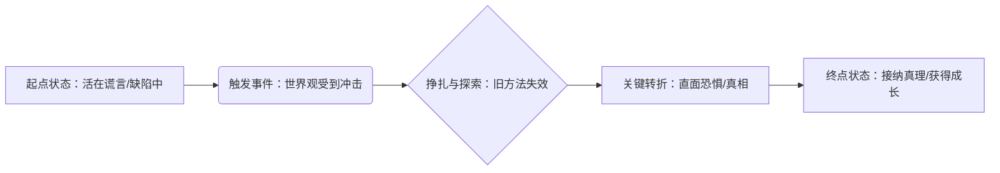

# 人物塑造与世界观融合技巧

> **核心理念**：人物不是孤立存在的，而是世界观的产物。人物的命运与世界的规则紧密交织。

---

## 目录

- [人物三维度：从皮囊到灵魂](#人物三维度从皮囊到灵魂)
- [人物记忆点：打造视觉与听觉锚点](#人物记忆点打造视觉与听觉锚点)
- [人物弧线：在世界中蜕变](#人物弧线在世界中蜕变)
- [人物关系设计：社会网络的节点](#人物关系设计社会网络的节点)
- [人物一致性检查：逻辑自洽的试金石](#人物一致性检查逻辑自洽的试金石)
- [人物与世界的共生关系](#人物与世界的共生关系)

---

## 人物三维度：从皮囊到灵魂

一个立体的人物必须包含三个层面的构建，缺一不可：

1.  **外在层（皮囊）**
    - **外貌特征**：不仅仅是美丑，而是具有辨识度的细节（如：伤疤、异瞳、特殊的穿衣风格）。
    - **社会身份**：职业、阶级、声望。这决定了他在世界中的位置。
    - **行为举止**：标志性的动作、微表情、走路姿势。

2.  **内在层（灵魂）**
    - **性格底色**：面对压力时的本能反应（如：逃避、对抗、伪装）。
    - **核心动机**：驱动人物行动的欲望（如：复仇、求知、生存、权力）。
    - **价值观/信仰**：人物坚信的真理，以及绝对不做的底线。

3.  **发展层（时间）**
    - **初始状态**：故事开始时的缺陷或平衡。
    - **人物弧线**：在经历冲突后，内在认知发生的改变。

---

## 人物记忆点：打造视觉与听觉锚点

为了让读者在数百个角色中瞬间记住他，需要设计“钩子”：

- **视觉锤**：一个极具反差或独特性的外貌/物品特征。
    - *示例：总是随身携带一把断剑的和平主义者。*
- **语言钉**：特定的口头禅、语癖或说话节奏。
    - *示例：说话总是喜欢用反问句；或者极度礼貌但言辞冰冷。*
- **反差萌/黑**：表面特质与内在特质的巨大割裂感。
    - *示例：外表粗犷的壮汉，却擅长精细的刺绣。*
- **特殊能力/经历**：只有他拥有的技能或背负的过往。

---

## 人物弧线：在世界中蜕变

人物弧线的本质是**“谎言”到“真理”**的认知升级。

- **正向弧光**：战胜弱点，成为更好的自己。
- **负向弧光**：被弱点吞噬，堕落或悲剧（如麦克白）。
- **平光弧光**：自身不变，用坚定的信念改变周围的世界（如福尔摩斯、美国队长）。

---

## 人物关系设计：社会网络的节点

人物关系不应只是“朋友”或“敌人”，而应是**功能性的互补与冲突**。

| 关系类型 | 核心功能 | 设计思路 | 示例 |
| :--- | :--- | :--- | :--- |
| **镜像关系** | 凸显主题 | 拥有相似起点，但因选择不同而走向不同结局的角色。 | 哈利·波特与伏地魔 |
| **互补关系** | 完善能力 | 弥补主角性格或能力短板的角色。 | 高智商侦探与武力担当助手 |
| **催化关系** | 推动剧情 | 迫使主角做出艰难选择，打破主角平静生活的角色。 | 带来坏消息的信使、诱惑者 |
| **情感锚点** | 展现软肋 | 主角愿意为之牺牲一切的人或物，展示人性温度。 | 必须保护的女儿、死去的妻子 |

---

## 人物一致性检查：逻辑自洽的试金石

在写完一个角色后，用以下清单进行“体检”，防止人设崩塌（OOC）：

- **动机检查**：他做这件事的**理由**是否充分？是否符合他的核心欲望？
- **能力检查**：以他的**能力和资源**，真的能做到这件事吗？还是需要“机械降神”？
- **语言检查**：这句台词是否符合他的**教育背景**和**性格**？（文盲不会引经据典，贵族不会满口脏话，除非有特殊原因）。
- **环境检查**：他的行为是否符合当前**世界观的规则**？（例如：在一个魔法被禁止的世界，法师是否会刻意隐藏施法动作？）

---

## 人物与世界的共生关系

> **重点**：人物是世界观的产物，世界观是人物的舞台。

- **环境塑造性格**：
    - 生长在废土世界的人，性格底色通常是**生存主义**和**多疑**。
    - 生长在乌托邦的人，性格底色通常是**天真**或**对体制的盲从**。
- **社会阶层的影响**：
    - 设计人物时，必须考虑他在世界权力结构中的位置。一个乞丐和一个国王，看待同一场雨的角度是截然不同的（乞丐担心生病，国王担心庄稼）。
- **世界观的冲突点**：
    - 人物最痛苦的时刻，往往是他个人的**价值观**与世界的**主流规则**发生碰撞的时刻。

---

**使用建议**：
在构建世界观时，先设定好世界的“规则”和“基调”，然后设计一个最能体现这种规则冲突的人物，让他成为读者探索这个世界的眼睛。

