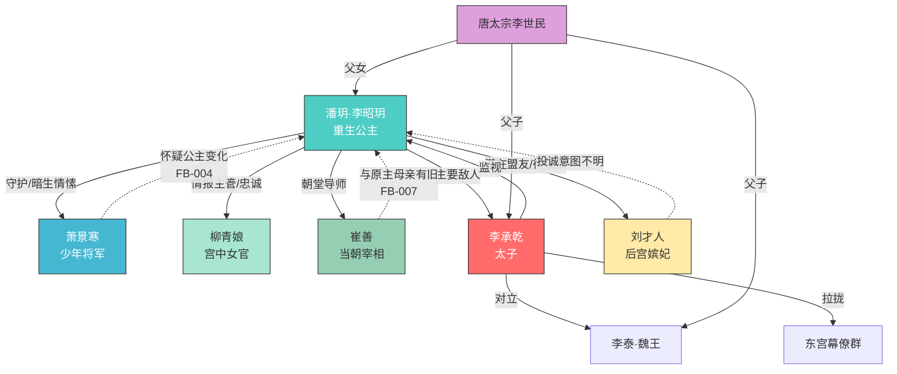

# 人物关系图（第一卷终）

> 最后更新：2026-03-28 · 第20章

## 关系状态说明

| 关系 | 类型 | 状态 | 备注 |
|------|------|------|------|
| 潘玥↔萧景寒 | 守护+暗生情愫 | 稳固中 | 萧开始产生怀疑 |
| 潘玥↔柳青娘 | 主仆/忠诚 | 稳固 | 开始执行情报网任务 |
| 潘玥↔崔善 | 师徒/暗助 | 建立中 | 与原主母亲有旧（待揭示） |
| 潘玥↔李承乾 | 敌对 | 升级中 | 太子怀疑公主为泄密者 |
| 潘玥↔刘才人 | 潜在盟友 | 待确认 | 投诚意图不明 |
| 潘玥↔太宗 | 父女 | 微妙 | 开始注意到这个女儿 |
