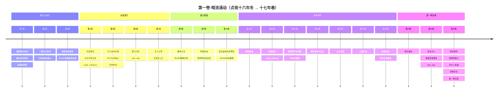

# 剧情时间线（第一卷）

> 最后更新：2026-03-28 · 第20章

```mermaid
timeline
    title 第一卷·暗流涌动（贞观十六年冬 → 十七年春）
    
    section 重生与适应
        第1章 : 潘玥重生长安
             : 确认身份转变
             : 初遇萧景寒
        第2章 : 了解公主处境
             : 不受宠的边缘人
        第3章 : 观察宫廷格局
             : FB-005青娘提及旧事
    
    section 初显锋芒
        第4章 : 冬宴首秀
             : 太宗开始注意
             : public_validation
        第5章 : 太子送来礼物
             : FB-006含暗记
             : 开始布局
        第6章 : 借刀打脸
             : face_slap
        第7章 : 太子之怒
             : 注意到公主
    
    section 建立联盟
        第8章 : 崔善关注
             : FB-007眼神异常
        第9章 : 雪夜密谈
             : 萧景寒信任加深
        第10章 : 首次运用历史预知
               : FB-008先知展现
    
    section 朝堂博弈
        第11章 : 朝堂暗涌
        第12章 : 初露锋芒
               : status_reversal
        第13章 : 萧景寒产生怀疑
               : FB-004推进
        第14章 : 御花园多方交汇
        第15章 : 太子试探
        第16章 : 以退为进
        第17章 : 崔善忠告
               : 师徒关系建立
    
    section 第一卷高潮
        第18章 : 暗流涌动
        第19章 : 反击太子
               : 春猎阴谋挫败
               : face_slap
        第20章 : 新的棋局
               : 情报网建立
               : 刘才人投诚
               : 突厥异动
               : 第一卷完结
```

## 伏笔时间线

```mermaid
gantt
    title 伏笔回收时间线
    dateFormat X
    axisFormat %d章
    
    section 主线伏笔
    FB-001 前世死因        :fb1, 1, 120
    FB-002 原主记忆碎片    :fb2, 1, 60
    FB-004 萧景寒怀疑      :fb4, 1, 30
    FB-008 历史预知展现    :fb8, 10, 30
    
    section 支线伏笔
    FB-005 青娘旧事        :fb5, 3, 65
    FB-006 太子礼物暗记    :fb6, 5, 40
    FB-007 崔善与原主母亲  :fb7, 8, 100
    
    section 已回收
    FB-003 伤疤消失        :done, fb3, 1, 1
```
