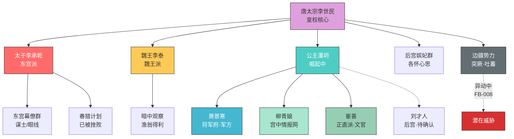

# 势力分布图（第一卷终）

> 最后更新：2026-03-28 · 第20章

## 势力对比

| 势力 | 实力 | 态度 | 变化趋势 |
|------|------|------|---------|
| 东宫派 | 强（嫡长子+老臣支持） | 敌对公主 | 📉 春猎计划被挫败 |
| 魏王派 | 中（暗中观察） | 中立/渔翁 | ➡️ 暂无动作 |
| 公主势力 | 弱→渐强 | 核心 | 📈 建立情报网+朝堂关系 |
| 将军府 | 中（军方影响） | 忠诚公主 | ➡️ 稳固 |
| 崔善/正直派 | 中（文官影响力） | 暗助公主 | 📈 关系加深 |
| 突厥 | 强（外部威胁） | 潜在入侵 | 📈 异动中 |
